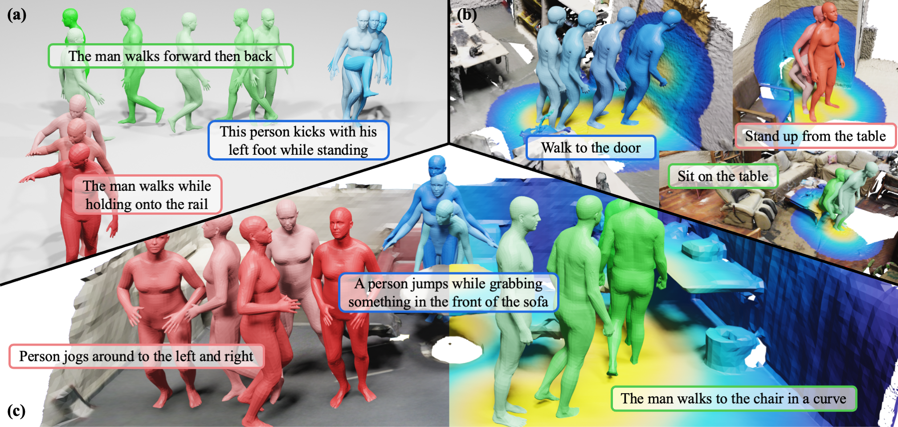

# Move as You Say, Interact as You Can: Language-guided Human Motion Generation with Scene Affordance

[](https://arxiv.org/abs/2403.18036)
[](https://afford-motion.github.io/static/pdfs/paper.pdf)
[](https://afford-motion.github.io/)

[Zan Wang](https://silvester.wang),
[Yixin Chen](https://yixchen.github.io/),
[Baoxiong Jia](https://buzz-beater.github.io/),
[Puhao Li](https://xiaoyao-li.github.io/),
[Jinlu Zhang](https://jinluzhang.site/),
[Jingze Zhang]()
[Tengyu Liu](http://tengyu.ai/),
[Yixin Zhu](https://yzhu.io/),
[Wei Liang](https://liangwei-bit.github.io/web/),
[Siyuan Huang](https://siyuanhuang.com/)

This repository is the official implementation of paper "Move as You Say, Interact as You Can:
Language-guided Human Motion Generation with Scene Affordance".

We introduce a novel two-stage framework that employs scene affordance as an intermediate representation, effectively linking 3D scene grounding and conditional motion generation.

[arXiv](https://arxiv.org/abs/2403.18036) | 
[Paper](https://afford-motion.github.io/static/pdfs/paper.pdf) | 
[Project](https://afford-motion.github.io/)

<div align=center>

</div>

## Abstract

Despite significant advancements in text-to-motion synthesis, generating language-guided human motion within 3D environments poses substantial challenges. These challenges stem primarily from (i) the absence of powerful generative models capable of jointly modeling natural language, 3D scenes, and human motion, and (ii) the generative models' intensive data requirements contrasted with the scarcity of comprehensive, high-quality, language-scene-motion datasets. To tackle these issues, we introduce a novel two-stage framework that employs scene affordance as an intermediate representation, effectively linking 3D scene grounding and conditional motion generation. Our framework comprises an Affordance Diffusion Model (ADM) for predicting explicit affordance map and an Affordance-to-Motion Diffusion Model (AMDM) for generating plausible human motions. By leveraging scene affordance maps, our method overcomes the difficulty in generating human motion under multimodal condition signals, especially when training with limited data lacking extensive language-scene-motion pairs. Our extensive experiments demonstrate that our approach consistently outperforms all baselines on established benchmarks, including HumanML3D and HUMANISE. Additionally, we validate our model's exceptional generalization capabilities on a specially curated evaluation set featuring previously unseen descriptions and scenes.

## Environment Setup

### Installation

1. Create a new conda env. and install `pytorch` with conda. Our `pytorch` version is 1.12.0 and `cuda` version is 11.3. 

```bash
conda create -n afford python=3.8
conda activate afford
conda install pytorch==1.12.0 torchvision==0.13.0 torchaudio==0.12.0 cudatoolkit=11.3 -c pytorch
```

2. Install other dependencies with `pip`.

```bash
pip install -r requirements.txt
```

### Data Preparation

You can directly download our preprocessed data from [OneDrive]() or following [data preparation](prepare/README.md) to preprocess the data by yourself. Oragize the data as follows:

```bash
- afford-motion/
  - body_models/
    - ...
  - data/
    - ...
  - outputs/
    - ...
  - configs/
  - datasets/
  - ...
```

## Evaluation on HumanML3D

### Train ADM

```bash
bash scripts/t2m_contact/train_ddp.sh ${EXP_NAME} ${PORT}
# e.g., bash scripts/t2m_contact/train_ddp.sh CDM-Perceiver-H3D 29500
```
  - `EXP_NAME`: the name of the experiment
  - `PORT`: the port number for parallel training
  - Our default setting is to train the model with multiple GPUs. You can use `train.py` to train your model with one GPU.

### Train AMDM

```bash
bash scripts/t2m_contact_motion/train_ddp.sh ${EXP_NAME} ${PORT}
# e.g., bash scripts/t2m_contact_motion/train_ddp.sh CMDM-Enc-H3D-mixtrain0.5 29500
```
  - the arguments are the same as above
  - Note that, please make sure the model can correctly load the pre-generated affordance maps. (You can insert a `print` to check if the code runs into Line 772 in `dataset/humanml3d.py`.)

> Note: We call the model ADM/AMDM as CDM/CMDM in our early implementation, so you may find the model name is CDM/CMDM in the code.

### Evaluate

#### 1. Pre-generate affordance maps

```bash
bash scripts/t2m_contact/test.sh ${MODEL_DIR} ${EVAL_MODE} ${RAND_SEED}
# e.g., bash scripts/t2m_contact/test.sh ./outputs/CDM-Perceiver-H3D/ wo_mm 2023
```
  - `MODEL_DIR`: the directory of the checkpoint
  - `EVAL_MODE`: `wo_mm` for evaluation without MM metric, `w_mm` for evaluation with MM metric
  - `RAND_SEED`: random seed, can be null

#### 2. Generate motion sequences

```bash
bash scripts/t2m_contact_motion/test.sh ${MODEL_DIR} ${AFFORD_DIR} ${EVAL_MODE} ${RAND_SEED}
# e.g., bash scripts/t2m_contact_motion/test.sh outputs/CMDM-Enc-H3D-mixtrain0.5/ outputs/CDM-Perceiver-H3D/eval/test-0413-205430 wo_mm 2023
```
  - `AFFORD_DIR`: the directory of the pre-generated affordance maps
  - other arguments are the same as above

#### 3. Calculate metrics

We calculate the metrics based on the code of [MDM](https://github.com/GuyTevet/motion-diffusion-model), so you first need to clone the MDM repository and setup the environment (Note that, MDM generates the motion and then calculate the metrics with a single program; we first generate the motion using our code, then calculate the metrics using MDM code). After generating the motion following the above two steps, you should follow the next steps to calculate the metrics. Assume you have cloned the MDM repository to `${PATH}/motion-diffusion-model/`.

a. copy the folder `save/` in [`h3d_eval`](h3d_eval/) to `${PATH}/motion-diffusion-model/`

b. copy `eval_h3d_dataset_offline.py` and `eval_h3d_offline.py` to `${PATH}/motion-diffusion-model/eval/`

c. put the absolute path of generated motion folders in Line72 and Line73 in `eval_h3d_offline.py`, respectively (The folders contains one generated with `wo_mm` and another with `w_mm`. The folder with `w_mm` can be null string if you don't want to calculate the MM metric.)

d. run the following commands to calculate:

```bash
python -m eval.eval_h3d_offline --model ./save/cmdm_h3d/model --eval_mode mm_short
```

## Evaluation on HUMANISE

### Train ADM

```bash
bash scripts/ts2m_contact/train.sh ${EXP_NAME} ${PORT}
# e.g., bash scripts/ts2m_contact/train.sh CDM-Perceiver-HUMANISE-step200k 29500
```
  - the arguments are the same as above

### Train AMDM

```bash
bash scripts/ts2m_contact_motion/train.sh ${EXP_NAME} ${PORT}
# e.g., bash scripts/ts2m_contact_motion/train.sh CMDM-Enc-HUMANISE-step400k 29500
```
  - the arguments are the same as above

### Evaluate

#### 1. Pre-generate affordance maps

```bash
bash scripts/ts2m_contact/test.sh ${MODEL_DIR} ${RAND_SEED}
# e.g., bash scripts/ts2m_contact/test.sh ./outputs/CDM-Perceiver-HUMANISE-step200k/ 2023
```
  - the arguments are the same as above

#### 2. Generate motion sequences

```bash
bash scripts/ts2m_contact_motion/test.sh ${MODEL_DIR} ${AFFORD_DIR} ${RAND_SEED}
# e.g., bash scripts/ts2m_contact_motion/test.sh outputs/CMDM-Enc-HUMANISE-step400k/ outputs/CDM-Perceiver-HUMANISE-step200k/eval/test-0415-214721/ 2023
```
  - the arguments are the same as above
  - The calculated metrics are stored in `${MODEl_DIR}/eval/${test-MMDD-HHMMSS}/metrics.txt`

## Evaluation on Novel Evaluation Set

### Train ADM

### Train AMDM

### Evaluate

## Citation

If you find our project useful, please consider citing us:

```tex
@inproceedings{wang2024move,
  title={Move as You Say, Interact as You Can: Language-guided Human Motion Generation with Scene Affordance},
  author={Wang, Zan and Chen, Yixin and Jia, Baoxiong and Li, Puhao and Zhang, Jinlu and Zhang, Jingze and Liu, Tengyu and Zhu, Yixin and Liang, Wei and Huang, Siyuan},
  booktitle={Proceedings of the IEEE/CVF Conference on Computer Vision and Pattern Recognition (CVPR)},
  year={2024}
}
```

### Acknowledgement

Partial code is borrowed from [MDM](https://github.com/GuyTevet/motion-diffusion-model), [HumanML3D](https://github.com/EricGuo5513/text-to-motion) and [HUMANISE](https://github.com/Silverster98/HUMANISE).

### License

This project is licensed under the MIT License. See [LICENSE](LICENSE) for more details.